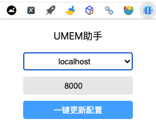

# UMEM-友盟登录助手

> 一键将友盟登录状态同步更新为 [UMEM](https://github.com/Samge0/UmengEventManage.git) 配置的chrome插件（该插件目前仅支持chrome浏览器）。

> UMEM = UmengEventManage，友盟统计自定义事件多应用一键同步 & 批量处理工具。




## 使用

- 1、下载"[UMEM助手-v1.0.0-chrome](https://github.com/Samge0/umem-plugin/releases/download/v1.0.0/UMEM-v1.0.0-chrome.zip) " 或者 拉取本项目源码编译（编译后会生成dist目录，在浏览器中"加载已解压的扩展程序"导入该目录即可）；

- 2、在Chrome浏览器中输入[chrome://extensions](chrome://extensions)，并开启开发者模式（点击右上角）；

- 3、将下载的插件文件解压后，点击"加载已解压的扩展程序"进行载入；

- 4、在使用UMEM助手之前，请先登录友盟账号 & 登录[UMEM](https://github.com/Samge0/UmengEventManage.git) 账号；

- 5、从浏览器右上角点击安装好的插件图标，选择目标服务器地址（[UMEM](https://github.com/Samge0/UmengEventManage.git) 项目部署的地址）+端口号（默认8000），点击【一键更新配置】，插件将自动同步友盟登录状态到 [UMEM](https://github.com/Samge0/UmengEventManage.git) 配置中，免去手动复制粘贴。

## 此项目版本

```
@vue/cli 4.5.7
yarn 1.22.10
```

## node_modules 安装

```
yarn install
```

> 如果遇到问题报错，可以查看[使用 vue-cli 创建 vue3.x 版本项目报错](https://guoqiankun.blog.csdn.net/article/details/111993759) 这篇文章

## 插件开发

```
yarn run watch
```

## 插件打包

```
yarn run build
```

## 其他说明

- 本项目基于 [my-vue3-plugin](https://github.com/18055975947/my-vue3-plugin) 开发而成，感谢原作者的开源。
- 以下为 [my-vue3-plugin](https://github.com/18055975947/my-vue3-plugin) 作者关于chrome插件开发的文章：
    - [CSDN 15000字大章带你一步一步使用Vue3开发chrome浏览器插件](https://guoqiankun.blog.csdn.net/article/details/112007833)
    - [掘金 15000字大章带你一步一步使用Vue3开发chrome浏览器插件](https://juejin.cn/post/6912295521172324360/)

